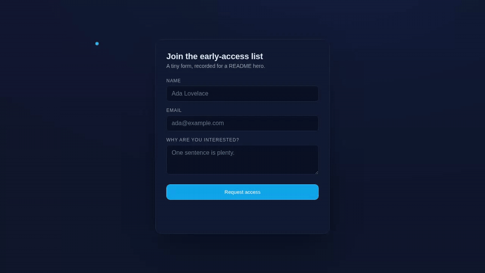
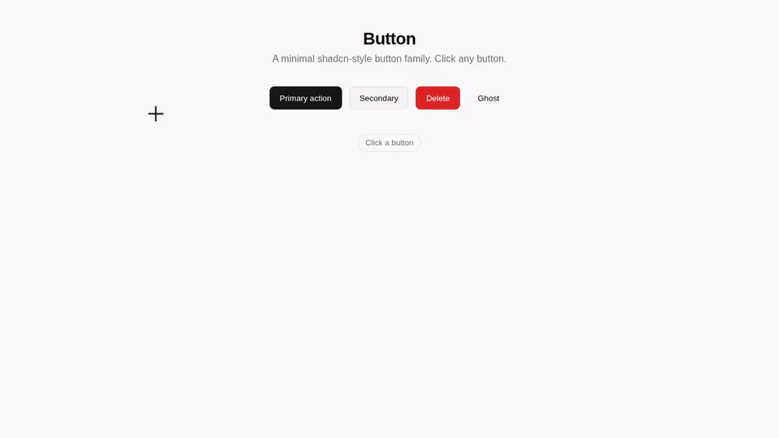

# Examples

Three example demos ship with the repo. Each demonstrates a distinct
combination of the recorder's features. Use them as starting points for
your own YAMLs.

To rebuild any of these locally:

```bash
./skills/readme-demo-recorder/scripts/record.sh examples/<example>/demo.yaml
```

The committed outputs in [`../docs/demos/`](../docs/demos/) were produced
from the same YAMLs.

---

## 1. `tabletop-runbook` — captions + multi-button flow


Source: [`examples/tabletop-runbook.yaml`](../examples/tabletop-runbook.yaml)
| MP4: [`docs/demos/tabletop-runbook.mp4`](demos/tabletop-runbook.mp4)

Records the catalyst project's tabletop exercise runbook — clicks
"Start", reveals two phase-1 injects, scrolls, then triggers
"Reveal All" and "Hide All". Three timed captions narrate the flow.

**What this example demonstrates:**

| Feature                          | Where it shows up                                                              |
|----------------------------------|--------------------------------------------------------------------------------|
| `mouse_park`                     | Pre-positions the cursor at `(0.6, 0.5)` so the very first frame has a cursor on screen. |
| Selector with `nth`              | `click: { selector: '#phase-1 .reveal-btn', nth: 0 }` — targets the first match without falling into the `:nth-of-type` CSS trap (see [demo-script-format.md § Common pitfalls](../skills/readme-demo-recorder/references/demo-script-format.md#common-pitfalls)). |
| `scroll_to`                      | Two scroll-to calls (down to phase-1, back to body) with smooth scrolling.     |
| Captions                         | Three timed overlays at 1.5 s, 5.0 s, and 11.0 s — burned into the MP4 so they propagate to the GIF automatically. |
| `pulse` cursor (default style)   | White circle + dark ring + blue pulse ring — the catalyst look.                |

**Output stats:** 1280×720, 24 fps, 18.2 s · MP4 1.6 MB · GIF 5.5 MB at 960 px / 12 fps (no cascade).

---

## 2. `form-submission` — typing + minimal cursor + dark theme



Source: [`examples/form-submission/demo.yaml`](../examples/form-submission/demo.yaml)
| HTML target: [`examples/form-submission/index.html`](../examples/form-submission/index.html)
| MP4: [`docs/demos/form-submission.mp4`](demos/form-submission.mp4)

Fills out a three-field sign-up form and submits it. The toast confirms
the click landed.

**What this example demonstrates:**

| Feature                          | Where it shows up                                                              |
|----------------------------------|--------------------------------------------------------------------------------|
| `type` step                      | Three different fields, each with its own per-keystroke `delay_ms`. The delay tunes how natural the typing feels — 22 ms reads as fast, 32 ms reads as deliberate. |
| `minimal` cursor style           | A small cyan dot, no ring, springy scale-down on click. Stays out of the way of the text being typed. |
| Custom `cursor.color` + `size`   | Brand-color cyan dot at 14 px instead of the default 22 px white circle.       |
| Self-contained example           | The HTML target lives next to the YAML; `target: ./index.html` resolves relative to the YAML file's directory. |
| Dark theme rendering             | Demonstrates that the recorder works on dark backgrounds — the cyan cursor stands out against `#0f172a`. |

**Output stats:** 1280×720, 24 fps, 10.5 s · MP4 0.15 MB · GIF 1.1 MB at 960 px / 12 fps.

---

## 3. `shadcn-button` — crosshair cursor + light theme + hover sequencing



Source: [`examples/shadcn-button/demo.yaml`](../examples/shadcn-button/demo.yaml)
| HTML target: [`examples/shadcn-button/index.html`](../examples/shadcn-button/index.html)
| MP4: [`docs/demos/shadcn-button.mp4`](demos/shadcn-button.mp4)

Cycles through four button variants — Primary, Secondary, Destructive,
Ghost — hovering each before clicking. Status badge updates after each
click.

**What this example demonstrates:**

| Feature                          | Where it shows up                                                              |
|----------------------------------|--------------------------------------------------------------------------------|
| `hover` step                     | Each button gets a `hover` (cursor moves to it) before the `click`. Demonstrates hover states on the button family. |
| `crosshair` cursor style         | Two perpendicular lines in dark ink with an indigo flash on click. Reads as "precision UI work" — appropriate for a component library demo. |
| Custom `cursor.color` + `pulse_color` + `size` | Dark ink (`rgba(24,24,27,0.95)`) on the light theme + indigo flash on click + 24 px footprint. |
| Light theme rendering            | Demonstrates that the recorder works on light backgrounds — the dark crosshair stands out against `#fafafa`. |
| Tiny output                      | Static page with minimal motion compresses to 0.18 MB GIF. Useful proof-point for "GIF size is a function of motion, not duration". |

**Output stats:** 1280×720, 24 fps, 14.5 s · MP4 0.08 MB · GIF 0.18 MB at 960 px / 12 fps.

---

## Mix and match

Most real-world demos combine elements from all three examples. Some
common combinations:

| Demo shape                                | YAML pattern                                                          |
|-------------------------------------------|----------------------------------------------------------------------|
| **App walkthrough with narration**        | `pulse` cursor + 3–5 captions + `click` / `scroll_to` / `wait`.       |
| **Form-fill demo**                        | `minimal` cursor + chained `type` steps + a final `click`.            |
| **Component library spotlight**           | `crosshair` cursor + `hover` → `wait` → `click` cycles per component. |
| **Onboarding flow**                       | `pulse` cursor + captions + `mouse_park` between sections.             |

For the full step-type catalog, see
[`skills/readme-demo-recorder/references/demo-script-format.md`](../skills/readme-demo-recorder/references/demo-script-format.md).

## Authoring your own

1. Pick the closest example.
2. Copy its `demo.yaml` (and `index.html` if applicable) to a new directory.
3. Edit `target` to point at your HTML.
4. Edit the `flow` to match the user actions you want to demonstrate.
5. (Optional) Add captions to narrate.
6. Run `record.sh path/to/your/demo.yaml`.
7. Inspect the produced MP4 in your video player and the GIF in any image
   viewer. Tune wait times if the demo feels rushed or sluggish, then
   re-run.

A typical authoring loop is **2–3 iterations** before the demo lands.
Each iteration is ~30 s of wall-clock time for a 20 s demo.
